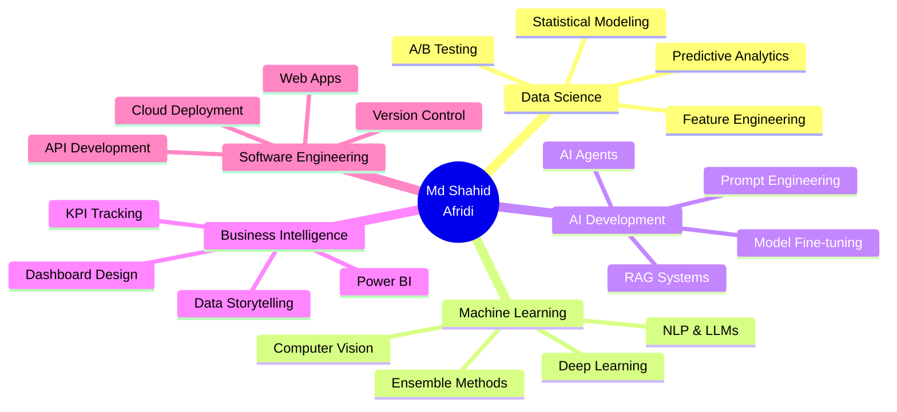
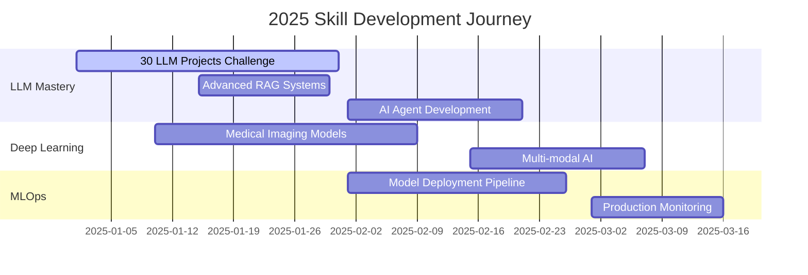

<div align="center">


### 💻 Data Scientist | 🤖 ML Engineer | 🧠 AI Innovator

<p align="center">
  <a href="https://www.linkedin.com/in/mdshahidafridi/">
    
  </a>
  <a href="mailto:msafridi1919@gmail.com">
    
  </a>
  <a href="https://github.com/ms-afridi">
    
  </a>
</p>


</div>

<br/>

## 🎯 About Me

```python
class DataScientist:
    def __init__(self):
        self.name = "Md Shahid Afridi"
        self.role = "Data Scientist & ML Engineer"
        self.education = "MS in Big Data Analytics"
        self.university = "Central University of Rajasthan"
        self.location = "India"
        
    def get_skills(self):
        return {
            "languages": ["Python", "SQL", "R"],
            "ml_frameworks": ["TensorFlow", "Keras", "Scikit-learn", "PyTorch"],
            "ai_tech": ["LLM Development", "Prompt Engineering", "NLP", "Computer Vision"],
            "data_viz": ["Power BI", "Matplotlib", "Seaborn", "Plotly"],
            "web_frameworks": ["Streamlit", "Flask", "FastAPI"],
            "cloud": ["Google Cloud", "AWS"],
            "databases": ["MySQL", "PostgreSQL", "MongoDB"]
        }
    
    def current_focus(self):
        return [
            "🚀 Building 30 LLM projects (AI Application Development)",
            "🧠 Deep Learning for Medical Imaging (Healthcare AI)",
            "📊 Advanced Business Intelligence Dashboards",
            "🤖 Autonomous AI Agents & RAG Systems"
        ]

me = DataScientist()
```

<br/>

## 🛠️ Technology Arsenal

<div align="center">

### Languages & Core Tools


### Machine Learning & Deep Learning


### Data Science Stack


### AI & LLM Development


### Web Frameworks


### Visualization & BI


### Cloud & DevOps


</div>

<br/>

## 🚀 Featured Projects

<div align="center">

<table>
<tr>
<td width="50%">

### 🧠 Alzheimer's Detection AI
**Healthcare Deep Learning System**

🎯 Custom CNN for medical imaging  
🏥 Streamlit clinical interface  
📍 Geolocation-based recommendations  
📄 Automated PDF reports  

**Stack:** `TensorFlow` `Keras` `Streamlit` `OpenCV`

[](https://github.com/ms-afridi/Alzheimer-Detection)

</td>
<td width="50%">

### 💳 Loan Approval ML System
**Intelligent Credit Assessment**

🤖 Ensemble ML (RF + LR)  
⚖️ Class imbalance handling  
🔍 Novel rejection reason API  
📊 Fairness & bias mitigation  

**Stack:** `Scikit-learn` `Flask` `XGBoost`

[](https://github.com/ms-afridi/loan_approval)

</td>
</tr>

<tr>
<td width="50%">

### 📊 HR Analytics Dashboard
**Business Intelligence Platform**

📈 Dynamic Power BI dashboards  
👥 Attrition analysis & insights  
🎯 Retention strategy recommendations  
📉 Department-wise trends  

**Stack:** `Power BI` `DAX` `SQL` `Excel`

[](https://github.com/ms-afridi/HR-ANALYTICS-DASHBOARD)

</td>
<td width="50%">

### 🤖 Top 30 LLM Projects
**AI Development Challenge**

🎓 Progressive learning path  
💬 Chatbots to AI Agents  
🔗 RAG & Vector Databases  
🚀 Production-ready apps  

**Stack:** `Groq API` `LangChain` `Streamlit`

[](https://github.com/ms-afridi/top-30-llm-projects)

</td>
</tr>
</table>

</div>

<br/>

## 📊 GitHub Analytics

<div align="center">
  
  
</div>

<div align="center">
  
  
</div>

<br/>

## 🏆 Achievements & Highlights

<div align="center">

| 🎖️ Achievement | 📅 Details |
|:---|:---|
| 🥇 **Analytix2024 Winner** | Central University of Rajasthan |
| 🎓 **MS in Big Data Analytics** | Research in Medical AI & Deep Learning |
| 💼 **Freelance Prompt Engineer** | LLM-based AI Agent Development |
| 📚 **Research Publication** | Alzheimer's Early Detection using CNNs |
| 🌟 **80+ GitHub Contributions** | Active in open-source development |
| 🎯 **30 LLM Projects Challenge** | Building production-ready AI applications |

</div>

<br/>

## 🌱 Community Impact

<table>
<tr>
<td width="50%" valign="top">

### 🎓 Education Volunteer
**eVidyaloka Foundation**
- Online English teacher for underprivileged students
- Promoting digital literacy & STEM education
- Empowering through accessible learning

</td>
<td width="50%" valign="top">

### 🤝 Social Initiatives
**Community Development**
- Active in social work programs
- Mentoring aspiring data scientists
- Contributing to tech education

</td>
</tr>
</table>

<br/>

## 💡 Expertise Matrix

<div align="center">



</div>

<br/>

## 📈 Current Learning Roadmap

<div align="center">



</div>

<br/>

## 🎯 What I'm Working On

<div align="center">

| 🔥 Current Projects | 📅 Status |
|:---|:---:|
| Building 30 production-ready LLM applications | 🚀 In Progress |
| Advanced CNN architectures for medical imaging | 🔬 Research Phase |
| Real-time data streaming pipelines | 📊 Planning |
| Autonomous AI agents with tool usage | 🤖 Development |
| MLOps best practices & deployment | ☁️ Learning |

</div>

<br/>

## 💬 Let's Collaborate!

<div align="center">

### I'm Open To:

<table>
<tr>
<td align="center" width="25%">

<br/><b>Collaboration</b>
<br/>ML/AI Projects
</td>
<td align="center" width="25%">

<br/><b>Freelancing</b>
<br/>Data Science Work
</td>
<td align="center" width="25%">

<br/><b>Mentorship</b>
<br/>Knowledge Sharing
</td>
<td align="center" width="25%">

<br/><b>Research</b>
<br/>Academic Partnerships
</td>
</tr>
</table>

<br/>

### 📫 Reach Out

<a href="https://www.linkedin.com/in/mdshahidafridi/">
  
</a>
<a href="mailto:msafridi1919@gmail.com">
  
</a>
<a href="https://github.com/ms-afridi">
  
</a>

<br/><br/>

### 💭 Quote of the Day


<br/>

### 🐍 Watch the Snake Eat My Contributions

<picture>
  <source media="(prefers-color-scheme: dark)" srcset="https://raw.githubusercontent.com/ms-afridi/ms-afridi/output/github-contribution-grid-snake-dark.svg">
  <source media="(prefers-color-scheme: light)" srcset="https://raw.githubusercontent.com/ms-afridi/ms-afridi/output/github-contribution-grid-snake.svg">
  
</picture>

<br/><br/>

---


**⭐ If you find my work valuable, please star my repositories! ⭐**

<sub>Built with ❤️ by Md Shahid Afridi | Last Updated: January 2026</sub>

</div>
